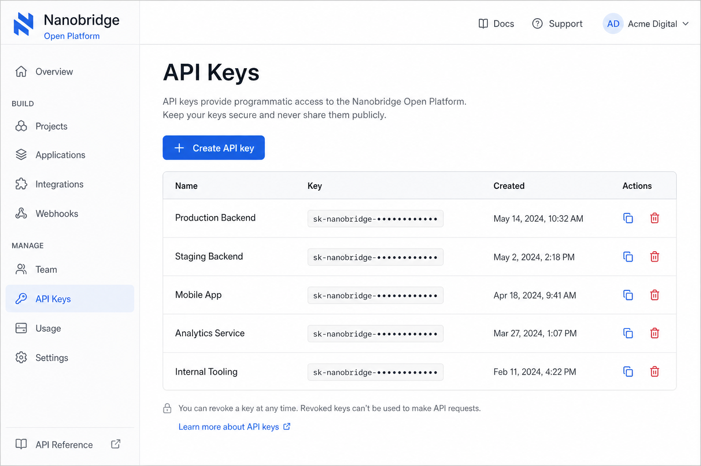
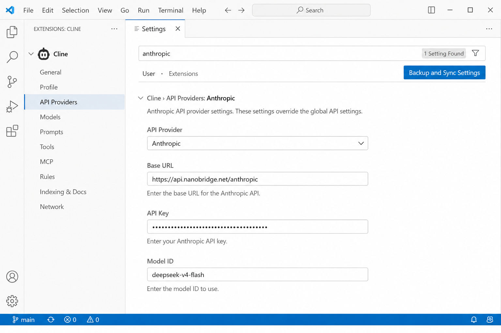

# DeepSeek in Cline - Complete Setup Guide

This guide shows how to use DeepSeek models in Cline.

Setup takes less than 5 minutes.

## Why Use DeepSeek in Cline

Benefits:

- Lower API cost
- OpenAI-compatible API
- Strong coding performance
- Large context window

## Requirements

Before starting, you need:

- Cline installed
- API key
- Internet connection

## Step 1 - Open Cline Settings


## Step 2 - Configure Provider


## Step 3 - Add API Key



## Step 4 - Select DeepSeek Model

Recommended:

- DeepSeek V4 Pro
- DeepSeek V4 Flash



## Step 5 - Test Your Setup

Try:

```
Create a simple React Todo App.
```

If the model responds correctly, your setup is complete.


## Common Errors

### 401 Unauthorized

Check API key.

### 429 Rate Limit

Wait and retry.

### Model Not Found

Verify model name.

## FAQ

### Is DeepSeek good for coding?

Many developers use DeepSeek for:

- Refactoring
- Debugging
- Code generation
- Agent workflows

### Is DeepSeek cheaper than Claude?

In many coding workflows, DeepSeek can be significantly cheaper.

## Related Guides

- [Cursor + DeepSeek](https://github.com/nanobridgerafa/cursor-deepseek-guide)
- [DeepSeek API Pricing](https://github.com/nanobridgerafa/deepseek-api-pricing)
- [OpenRouter Alternatives](https://github.com/nanobridgerafa/openrouter-alternative)

Provider used in the screenshots: Nanobridge.

## License

MIT
