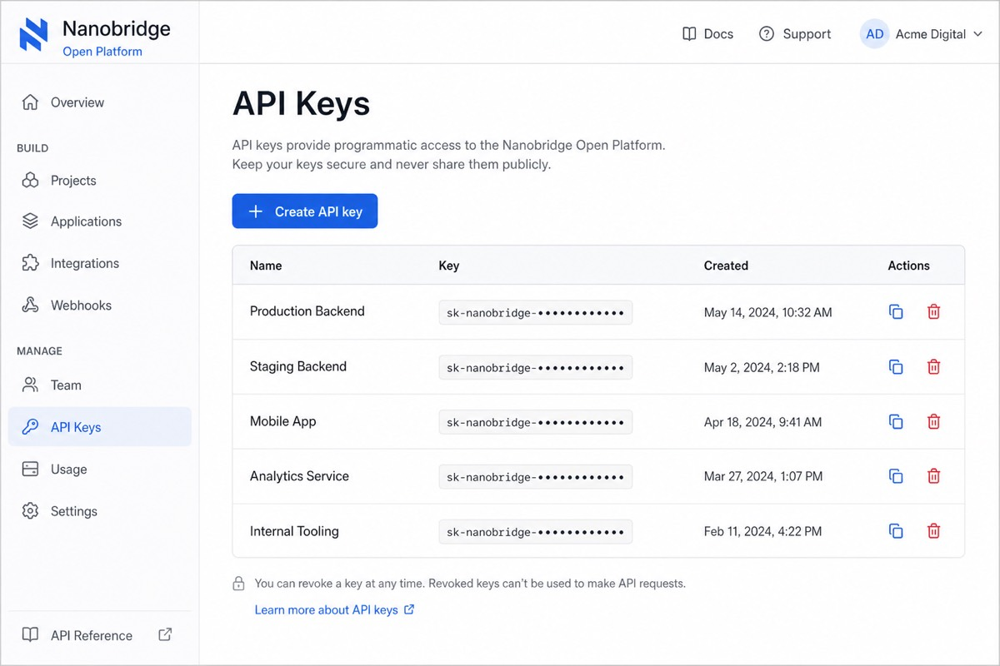
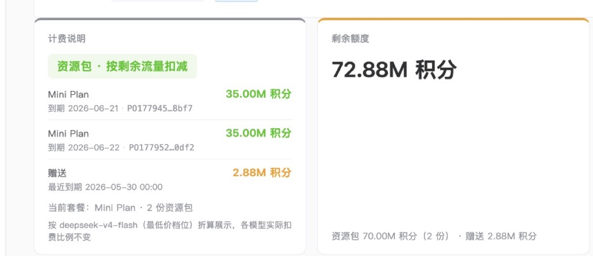

# DeepSeek in Cline - Complete Setup Guide

This guide shows how to use DeepSeek models in Cline via [Nanobridge](https://www.nanobridge.ai) — an OpenAI- and Anthropic-compatible API gateway.

Setup takes less than 5 minutes.

## Links

| Resource | URL |
|----------|-----|
| Website | [nanobridge.ai](https://www.nanobridge.ai) |
| Console (API keys & billing) | [platform.nanobridge.net](https://platform.nanobridge.net) |
| API documentation | [platform.nanobridge.net/#/api-docs](https://platform.nanobridge.net/#/api-docs) |

## Why Use DeepSeek in Cline

Benefits:

- Lower API cost
- OpenAI-compatible API
- Strong coding performance
- Large context window

## Requirements

Before starting, you need:

- [Cline](https://cline.bot) installed in VS Code
- A Nanobridge API key ([create one in the console](https://platform.nanobridge.net))
- Internet connection

## Configuration Reference

Cline uses the **Anthropic** provider with a custom Base URL. Use these values in **Cline → Settings → API Providers**:

| Setting | Value |
|---------|-------|
| API Provider | `Anthropic` |
| Base URL | See regional table below |
| API Key | Your Nanobridge API key |
| Model ID | `deepseek-v4-flash` (recommended) or `deepseek-v4-pro` |

**API requests go to the gateway hosts** — not the console URL (`platform.nanobridge.net`).

| Region | Anthropic Base (for Cline) |
|--------|----------------------------|
| Germany (default) | `https://api.nanobridge.net/anthropic` |
| Singapore | `https://api-sg.nanobridge.net/anthropic` |
| United States | `https://api-us.nanobridge.net/anthropic` |

The same API key works across all regions. Pick the node closest to you for lower latency.

### Supported models

| Model ID | Notes |
|----------|-------|
| `deepseek-v4-flash` | **Recommended default** — balanced cost and latency |
| `deepseek-v4-pro` | Stronger reasoning |
| `deepseek-v3.2` | DeepSeek V3.2 |

Full model catalog and pricing: [API docs](https://platform.nanobridge.net/#/api-docs)

## Step 1 - Open Cline Settings

Open VS Code, then go to **Cline → Settings** (gear icon in the Cline panel).


## Step 2 - Configure Provider

In **API Providers**, set **API Provider** to **Anthropic** and enter the **Base URL** from the table above.


## Step 3 - Add API Key

Paste your Nanobridge API key into the **API Key** field.

Create or copy a key from the [console](https://platform.nanobridge.net) if you do not have one yet.



## Step 4 - Select DeepSeek Model

Enter the model ID in the **Model ID** field:

- `deepseek-v4-flash` — recommended for most coding tasks
- `deepseek-v4-pro` — for harder reasoning or refactors


## Step 5 - Test Your Setup

Try:

```
Create a simple React Todo App.
```

If the model responds correctly, your setup is complete.



## API Endpoints

Cline sends requests through the Anthropic Messages API. Under the hood:

- **Endpoint**: `POST /v1/messages` (on your chosen Anthropic base URL)
- **Auth**: `Authorization: Bearer <API_KEY>`
- **Streaming**: supported via SSE

For direct API testing (curl, SDK, other tools), see the full reference in the [API documentation](https://platform.nanobridge.net/#/api-docs).

## Common Errors

### 401 Unauthorized

- Verify your API key in the [console](https://platform.nanobridge.net)
- Make sure there are no extra spaces when pasting the key

### 429 Rate Limit

Wait and retry, or check your quota in the console billing page.

### Model Not Found

Use supported model IDs (`deepseek-v4-flash`, `deepseek-v4-pro`, `deepseek-v3.2`). Do not use retired names like `deepseek-v3` or `deepseek-reasoner`.

### Connection / Timeout

- Confirm the Base URL is a gateway host (`api*.nanobridge.net/anthropic`), not the console (`platform.nanobridge.net`)
- Try a regional node closer to your location

## FAQ

### Is DeepSeek good for coding?

Many developers use DeepSeek for:

- Refactoring
- Debugging
- Code generation
- Agent workflows

### Is DeepSeek cheaper than Claude?

In many coding workflows, DeepSeek can be significantly cheaper. See current rates in the [API docs](https://platform.nanobridge.net/#/api-docs).

### Can I use the OpenAI base URL in Cline?

Cline's native provider is **Anthropic**. Use the Anthropic base URL from the table above. For OpenAI-compatible tools (Cursor, Continue, Aider), see the [Cursor + DeepSeek guide](https://github.com/nanobridgerafa/cursor-deepseek-guide).

## Related Guides

- [Cursor + DeepSeek](https://github.com/nanobridgerafa/cursor-deepseek-guide)
- [DeepSeek API Pricing](https://github.com/nanobridgerafa/deepseek-api-pricing)
- [OpenRouter Alternatives](https://github.com/nanobridgerafa/openrouter-alternative)

---

Provider used in the screenshots: [Nanobridge](https://www.nanobridge.ai).

Nanobridge is an independent inference gateway and is not affiliated with Anthropic or DeepSeek.
